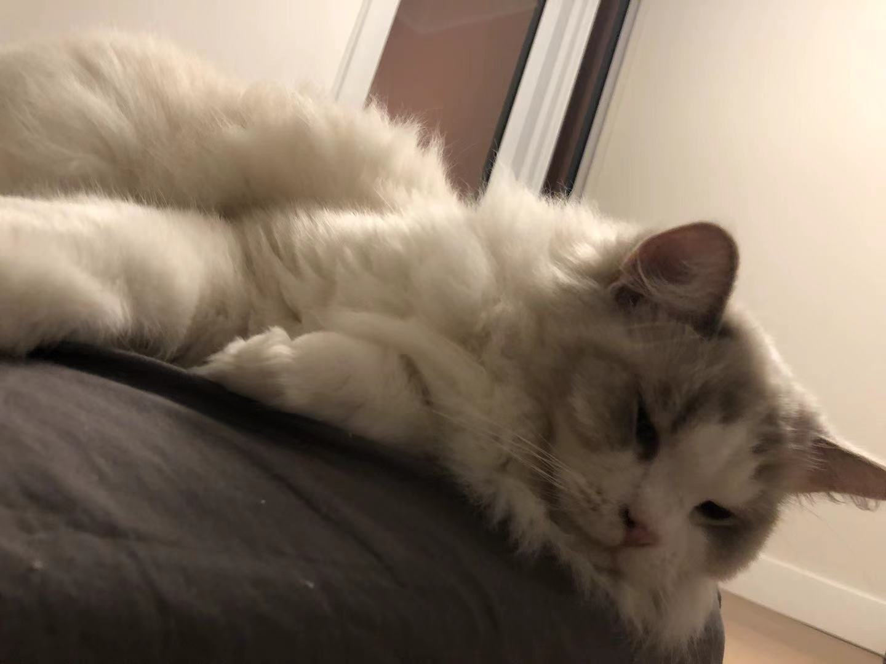

### Hi, I am Hang Wang! :wink:

I am
- [X] currently in China
- [X] in **CS** major
- [X] last year in UCSD

I am facing a ***big*** situation:
> graduatation

I'm not sure if I'm ready to step into society and break away from being a student.

We all know that **society** is:
```
realistic
tense
```
In order to better end my college life, I made some decisions for myself:
- Finish the rest of my studies as usual
- More participation in extracurricular activities, improve my own skills
- Keep a positive attitude

The Relative link to [README.md](./README.md) file.

The link to [My Lab1](https://github.com/ericwang994/CSE110Lab1).

At the end, I'd like to share my favorite cat:

